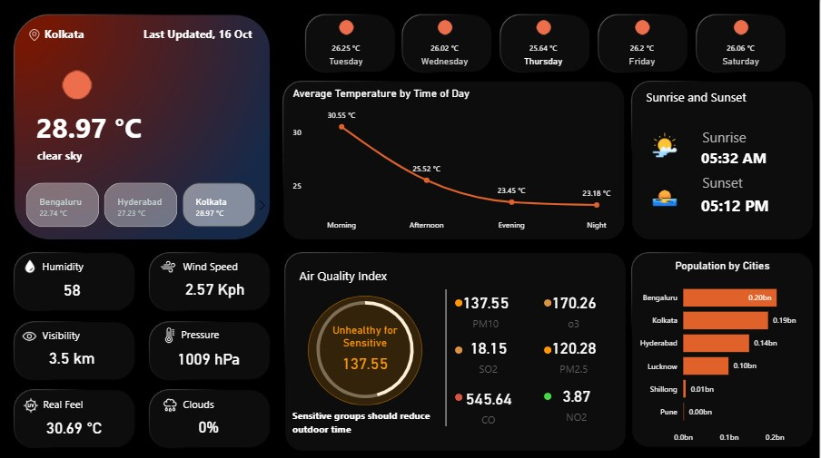

# 🌤️ Live Weather Dashboard using Power BI & OpenWeather API



## 📌 Project Overview
This Power BI dashboard provides **live weather insights** for 6 major Indian cities using **OpenWeather’s Free APIs**.  
It fetches **real-time data**, **5-day weather forecasts**, and **air quality data**, then visualizes them in a clean, interactive format.

The dashboard is designed to **auto-refresh daily**, ensuring users always see the latest weather information.


## 🧠 Key Features
- 🌡 **Current Weather**: Displays live temperature, weather conditions, humidity, visibility, wind speed, pressure, cloud cover, and real feel temperature.  
- 📅 **5-Day Forecast**: Line chart showing average temperature trends across different times of the day for upcoming 5 days.  
- ☀️ **Sunrise & Sunset Times**: Converted from UNIX UTC to IST for accuracy.  
- 🌬 **Air Quality Index (AQI)**: Includes major air pollutants like PM10, PM2.5, O3, SO2, NO2, and CO with live AQI status.  
- 🏙 **Population by Cities**: Static dataset showing population for selected cities.  
- 🔄 **Scheduled Auto Refresh**: Data is refreshed daily through Power BI Service to keep the dashboard updated.


## 🌍 Cities Covered
The dashboard includes live and forecast data for the following cities:

| City        | Latitude | Longitude |
|-------------|----------|-----------|
| Kolkata     | 22.5726  | 88.3639   |
| Lucknow     | 26.8467  | 80.9462   |
| Hyderabad   | 17.3850  | 78.4867   |
| Bengaluru   | 12.9716  | 77.5946   |
| Pune        | 18.5204  | 73.8567   |
| Shillong    | 25.5788  | 91.8933   |


## 🔧 Tools & Technologies Used
- **Power BI Desktop** – for data modeling and dashboard design  
- **Power Query** – for data transformation (date/time conversions, cleaning, formatting)  
- **OpenWeather API (Free Plan)** – for fetching current weather, forecast, and air quality data  
- **DAX** – for custom calculated columns and measures (e.g., temperature formatting, time periods, sunrise/sunset conversion)  
- **Power BI Service** – for publishing and scheduling auto refresh


## 🌐 Data Sources
Three different OpenWeather API endpoints were used:

1. **Current Weather API**  
   `https://api.openweathermap.org/data/2.5/weather?lat={lat}&lon={lon}&appid={API_KEY}&units=metric`

2. **5-Day / 3-Hour Forecast API**  
   `https://api.openweathermap.org/data/2.5/forecast?lat={lat}&lon={lon}&appid={API_KEY}&units=metric`

3. **Air Pollution API**  
   `https://api.openweathermap.org/data/2.5/air_pollution?lat={lat}&lon={lon}&appid={API_KEY}`

All data was imported into Power BI using the **“Web” connector** and transformed using Power Query.


## 🧠 Data Transformation Highlights
- Converted UNIX timestamps to IST using DAX:
  ```DAX
  Sunrise_IST = 'Table'[sunrise] / 86400 + DATE(1970,1,1) + TIME(5,30,0)
  Categorized time of day into Morning, Afternoon, Evening, and Night for temperature trend analysis.
  Formatted visibility, pressure, and temperature values for better readability.
  Removed duplicate records and kept daily unique forecasts per city.```


## 🕒 Auto Refresh Configuration
The dashboard was published to Power BI Service, and a scheduled refresh was configured to run once per day, ensuring that the displayed data remains live and up-to-date.


## 📷 Dashboard Preview
[


## 🙌 Acknowledgements
**[OpenWeather Website](https://openweathermap.org/)** for providing free access to weather and air quality data.
**Power BI** for its robust visualization and transformation capabilities.


## 📬 Contact

If you’d like to connect or have any questions about this project, feel free to reach out:

- **Name:** Kumkum Pal  
- **LinkedIn:** [LinkedIn Profile](https://www.linkedin.com/in/kumkum-pal-56992b239/)  
- **GitHub:** [GitHub Profile](https://github.com/darktornedo)  
- **Email:** kumkumpal404@gmail.com
